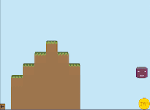

# Preserve

[Play Preserve!](https://i-yam-jeremy.github.io/preserve)

Preserve is a game I made for the 48-hour CPGD Game Jam. I have made some minor bug fixes and updates since then to polish off the game, however there are also links to the 48-hour Game Jam [release](https://github.com/i-yam-jeremy/preserve/releases/tag/v1.0) and [demo](https://i-yam-jeremy.itch.io/preserve).

## Game Concept
Preserve is a 2D puzzle platformer. You play as a jar of jam and you can liquify your character to turn into liquid jam. If you jam droplets (jamlets) separate, you will form multiple jars when de-liquifying back into jar form. This can be useful so you can press buttons or fit thru spaces larger jars wouldn't be able to. The goal of the game is to preserve as many jamlets as possible by getting them to the finish. The main idea behind this game came from the phrase "Game Jam". I thought "huh? what if I made a game about jam". And the rest was history. Even the name Preserve is another jam-related pun.

## Gameplay

### Movement
Move with the arrow keys. Left and right to move sideways. Up to jump. If you are against a wall you can multiple jump up the wall.

### Liquifying & De-liquifying
Press <space> to liquify or de-liquify. If in jar mode you will transform into jam droplets (jamlets) which have no movement controls and only are affected by gravity and momentum. However, jamlets are smaller and can fit through smaller spaces. When converting back into jar mode, if jamlets are not touching, they will form separate jars. Jamlets are divided into clumps and converted to jars corresponding to the size of each clump.

### Finish Block
The goal of the game is to get your jamlets to the finish block. You must be in liquid form for the jamlets to be counted when touching the finish.

### Buttons & Gates
Buttons can open gates. To press a button you must be touching it when in jar form. The button will open its attached gate. When you step off a button, the gate will close.

### Spikes
Spikes will kill your jamlets. Your jars are protected, however if you convert to liquid form any jamlets touching spikes will die and you will lose them. This will make the level more difficult or even impossible depending on how many jamlets die. If you lose all your jamlets, you will go back to the level select menu.

